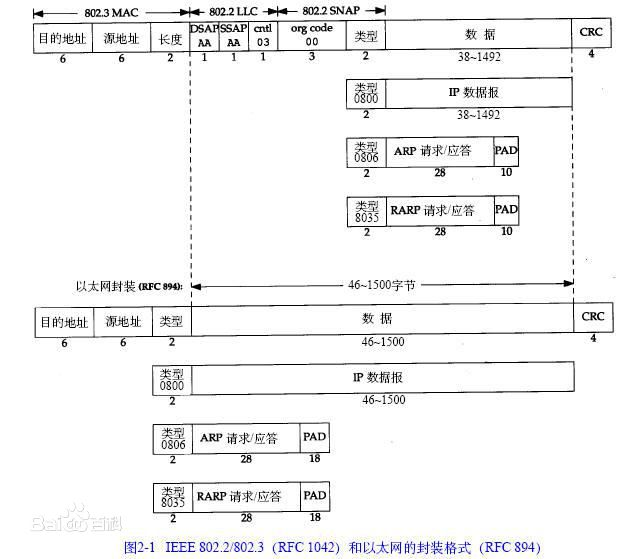
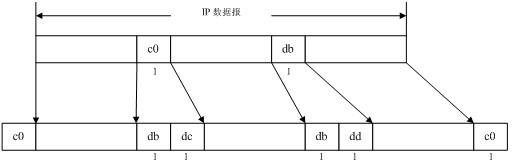

# 链路层

[TOC]

## 引言

链路层的目的：
- 为IP模块发送和接受IP数据报
- 为ARP模块发送ARP请求和接受ARP应答
- 为RARP模块发送RARP请求和接受RARP应答

链路层支持多种协议：以太网、令牌环网、FDDI等

## 以太网和IEEE 802封装

- 6字节的目的地址和源地址：
    + 硬件地址
    + ARP和RAPR协议和32bit和48bit硬件地址进行映射
- 2字节：
    + 802标准定义了后续字节的长度（不包括CRC校验码）
    + 以太网定义后续数据的类型
- 以太网后续的字节是数据内容
- CRC:后续字节的差错循环冗余码检验

## 其他封装形式（SLIP）

Serial Line IP:串行线路IP，在串行线路上对IP数据报进行封装的简单形式。

帧格式特点：
- 以END(0xc0)特殊字符作为结束标志
- 如果报文中有END字符，则需要用连续传输 0xdb 0xdc来替代。0xdb被称为SLIP中的ESC字符。
- 如果报文中有SLIP中的ESC字符，则需要用连续传输 0xdb 0xdd来替代。

SLIP的缺点：
- 必须知道对方的IP地址。
- 无类型字段。一条串行线路用于SLIP，就无法使用其他协议
- 无检验和。依赖上层协议发现传输错误。

## 其他封装形式（PPP）

PPP，即点对点协议。 修改了SLIP中的缺点。包括以下三个部分：
- 提供在串行线路上封装IP数据报的方法。支持异步同步链接
- 链路控制协议。允许通信双方经过协商确定不同选项。
- 针对不同网络层的网络控制协议。

### 环回接口

即大多数系统的localhost:127.x.x.x。  当IP数据报离开网络层时把它返回给自己。

### 最大传输单元和路径MTU

MTU:当IP层传送的数据大于MTU时，需要进行切片。

一个网络上的两个主机进行通信时，重要的是通信路径中的最小MTU，即路径MTU
