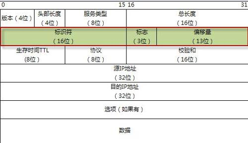

# IP：网际协议

[TOC]

## 引言

IP协议的特点：
- 不可靠：不保证数据成功到达目的地
- 无连接：不维护数据报后续的状态信息，IP数据报可以不按顺序接收，每个数据报独立地选择路由。

## IP首部

- 版本号：IPv(4)和IPv(6)
- 首部长度：指首部占32bit的数目。普通数据报的值是5，即20字节。
- 服务类型（TOS）：
- 总长度：指整个数据报的长度。根据首部长度和总长度可以计算内容起始位置和长度。
- 标识字段：唯一地标识主机发送的每份数据报
- TTL生存时间：可以经过的最多路由数，即指定数据报的生存时间。
- 协议字段：对数据报进行分用。
- 首部检验和：根据IP首部计算的检验和码。
- 目的地址和源地址：

## IP的路由选择

IP层中维护着一个路由表，包含以下信息：
- 目的IP地址
- 下一站路由器的地址
- 标志：
- 为传输指定的网络接口

路由选择行为：
1. 搜索路由表中与目的地址完全匹配的表目。
2. 寻找目的的网络号相匹配的表目。
3. 寻找默认的表目
4. 丢弃或返回不可达。

## 子网寻址

主机号再分成一个子网号和主机号。
子网对外部路由器隐藏了内部网络组织。
这样可以缩小路由表的规模。对一个网段只需要一个路由表。

## 子网掩码

子网掩码可以用来确定分别用于子网号和主机号的比特数。

掩码中1代表网络号和子网号的比特位，0代表主机号的比特。

## ifconfig

