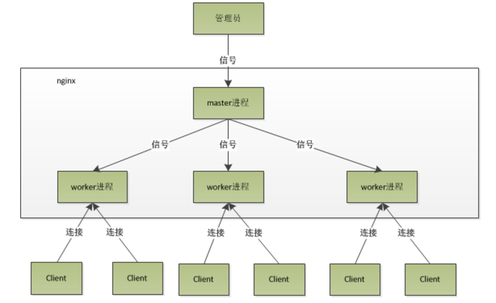

# nginx

[TOC]

## nginx的进程模型



## nginx性能高效的原因（异步非阻塞方式)

对于网络事件的处理：
- 阻塞方式：请求到达时，没有准备好相应的服务，等待。
- 非阻塞方式：请求到达时，没有准备好服务，返回EAGAIN,过会儿重新发请求
- 异步非阻塞方式：调用的时候是阻塞的，在请求池中等待的时候设置超时时间，时间内准备好了，则返回

***

## nginx配置文件

```
user nobody nobody; #运行 nginx 的所属组和所有者
worker_processes 2; #开启两个 nginx 工作进程,一般几个 CPU 核心就写几

#error_log  logs/error.log  notice; #错误日志路径
pid        /usr/local/var/run/nginx.pid; #pid路径

events {
    worker_connections  128; #一个进程能同时处理的请求数
}

http {
    include       mime.types;
    default_type  application/octet-stream;

    log_format  main  '$remote_addr - $remote_user [$time_local] "$request" '
                      '$status $body_bytes_sent "$http_referer" '
                      '"$http_user_agent" "$http_x_forwarded_for"';

    access_log  /usr/local/var/logs/access.log  main; #默认的访问日志路径
    root /var/www;
    sendfile        on;
    #tcp_nopush     on;

    keepalive_timeout  6500; #超时时间

    #gzip  on;
    #开始配置域名，一个server段对应一个域名
    #虚拟主机
    server {
        listen       8080;#在本机所有ip上监听80端口，
        server_name  localhost; #域名
        root /var/www/tiny.com; #站点根目录

        #access_log  logs/host.access.log  main;

        location / {
            root   html; 
            index  index.html index.htm; #索引文件
        }

        error_page   500 502 503 504  /50x.html;
        #定义错误页面,如果是 500 错误,则把站点根目录下的 50x.html 返回给用户
        location = /50x.html {
            root   html;
        }

        location ~ \.php$ {
            root           html;
            fastcgi_pass   127.0.0.1:9000;//tcp方式转发给php-fpm
            fastcgi_index  index.php;
            fastcgi_param  SCRIPT_FILENAME  /scripts$fastcgi_script_name;
            include        fastcgi_params;
            client_max_body_size    100m;
        }
    }
    
    include /usr/local/etc/nginx/sites-enabled/*;
}
```
